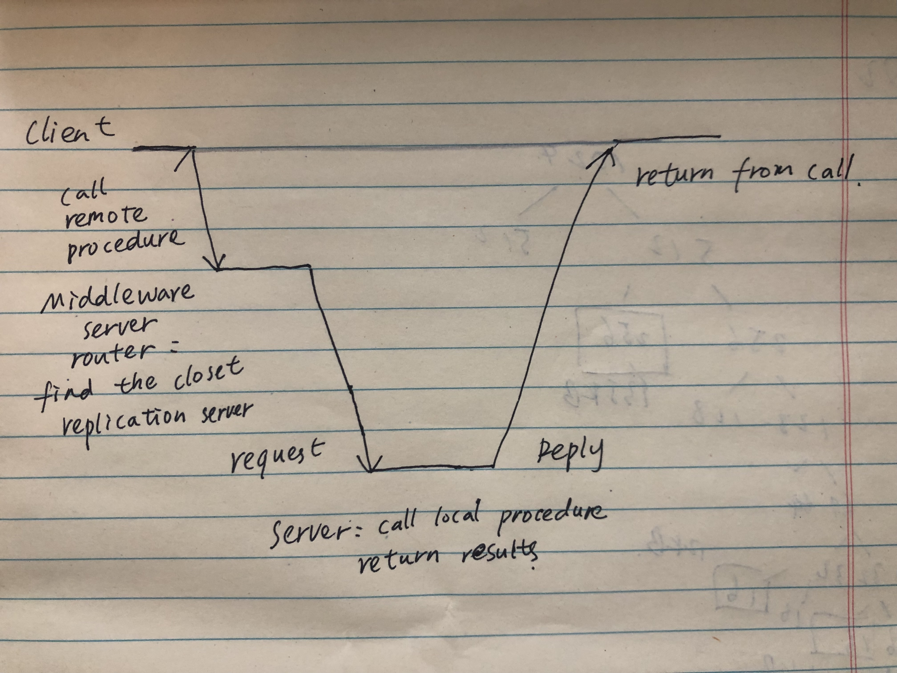

Homework 1 questions: 

1. Give an example of how a high degree of distribution transparency can have an adverse effect on performance.

    Textbook mentions the example of location-based services. An example would be a service finding the nearest Chinese take-away, in this case, hiding distribution will have an adverse effect on performance. 

2. What do you see as the main scalability problems with a video conferencing application across an increasing number of users?

    The video conferencing app is mainly an network-bound services and it will suffer from both size and geographical scalability problems. If this service sets up point-to-point connections with its customers, it may need to deal with limited bandwidth. Another problem is that communication in WANs is much less reliable than LANs. 
 
3. What do you see as the main scalability problem in realizing a system according to a shared data space architecture?

    Referentially and temporally decoupled processes in a shared data space communicate entirely through tuples. Besides the size scability problem, the main scalability problem is the efficient implementation of matching subscriptions to notifications. 

4. For a while, fat clients gained popularity, notably when dealing with Web applications. Why?

    From textbook, we know that fat clients are used when the client machine is a PC or workstation, connected through a network to a distributed file system or database. Essentially, most of the application is running on the client machine,but some/all operations on files or database entries go to the server. 

    It is popular among web applications because of:
     1. Performance: the client's local disk can contain part of the data. For example, a cache for most renct inspected web pages.
     2. Less system-management concern: With the advent of advanced Web browsing technology, it is now much easier to dynamically place and manage client-side software by simply uploading (the sometimes very sophisticated) scripts.
     3. Less platform dependency issue: this type of client-side software runs in welldefined commonly deployed environments

5. Today, thin clients are making a comeback. Why?

    Comparing with thin clines, fat ones are harder to manage. The softwares needs to be resilient to end-user behavior. In addtion, clientside software is dependent on the client's underlying platform, which means that multiple versions will need to be maintained. 

6. Consider a client/server system based on RPC, and assume the server is replicated for performance.  Briefly sketch an RPC-based solution for hiding replication of the server from the client.
   
    

    I assume that all replicated servers have the same name. 

   1. The client procedure calls the client stub in the normal way.
   2. The client stub builds a message and calls the local operating system.
   3. The client’s OS sends the message to the remote OS.
   4. The remote OS gives the message to the middleware server stub.
   5. The middleware server stub acts as a router, find the nearest server and gives the message to the destination server stub
   6. The destination server stub unpacks the parameter(s) and calls the server.
   7. The server does the work and returns the result to the stub.
   8. The server stub packs the result in a message and calls its local OS.
   9. The server’s OS sends the message to the client’s OS.
   10. The client’s OS gives the message to the client stub.
   11. The stub unpacks the result and returns it to the client.

   By using a first server as a middleware router, we can "hide" the replicated servers from the client. 

   There is one serious drawback to replication. Because we now have multiple copies of a server resources, modifying one copy makes that copy different from the others. We should make sure that an update must be immediately propagated to all other copies. Moreover, if two updates happen concurrently, it is often also required that updates are processed in the same order everywhere, the middleware server will have to make sure the consistency remains. 